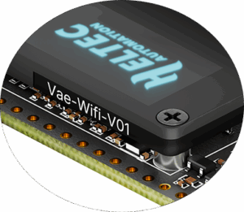
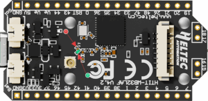
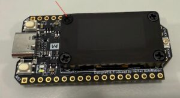

# WiFi LoRa 32 Frequently Asked Questions

## German Warehouse Supported Countries/Regions 

Austria, Belgium, Bulgaria, Croatia, Czech Republic, Denmark, Estonia, Finland, France, Germany, Hungary, Ireland, Italy, Latvia, Lithuania, Luxembourg, Malta, Netherlands, Norway, Poland, Portugal, Romania, Slovakia, Slovenia, Spain, Sweden, Switzerland, United Kingdom.

## US Warehouse Supported States/Regions:
- South: Alabama, Arkansas, Delaware, Florida, Georgia, Kentucky, Louisiana, Maryland, Mississippi, North Carolina, Oklahoma, South Carolina, Tennessee, Texas, Virginia, West Virginia
- Midwest: Illinois, Indiana, Iowa, Kansas, Michigan, Minnesota, Missouri, Nebraska, North Dakota, Ohio, Pennsylvania, South Dakota, Wisconsin
- West: Arizona, California, Colorado, Idaho, Montana, Nevada, New Mexico, Oregon, Utah, Washington, Wyoming
- Northeast: Connecticut, District of Columbia, Maine, Massachusetts, New Hampshire, New Jersey, New York, Rhode Island, Vermont
- Not Supported: Alaska, Hawaii, Puerto Rico

## 2.4GHz Antenna
The default 2.4G FPC antenna is located on the side of the plastic screen bracket.

If you wish to use an IPEX-connected 2.4G antenna, you need to remove the inductor marked as ① in the diagram below, and add a 0-ohm resistor (or other conductive metal or cable) at the position marked ② to connect to the IPEX interface.

## My screws look a bit odd

This area is attached with a 2.4G FPC antenna,and to avoid affecting its performance, customized plastic screws are used here. That’s why they look different from ordinary screws. When you need to remove it, gently press and turn with a screwdriver.

## What development methods does it support
- Arduino
- Micro Python
- Platform.io
- Espressif IDE
We strongly recommend using Arduino. We have complete technical support and provide complete LoRaWAN code for [ESP32 Arduino framework](https://github.com/Heltec-Aaron-Lee/WiFi_Kit_series/tree/master).

## What’s the battery socket type
You can find this type of socket by search “SH1.25 x 2”.

## Can I order a version without the OLED display

Of course, you can contact our sales staff and provide your ideas.

## Are V3 and V4 compatible

They are compatible in most scenarios.
Since V4 uses the same series of chips as V3, features the same OLED, and has an almost identical pin layout, V3 and V4 can be used interchangeably in the majority of cases.
However, due to the increased transmit power, the transmit power settings in some code may no longer correspond directly to the actual output.

## Failed to upload code
Please try the following steps:

1.Try using a different USB cable.

2.Enter BootLoader mode. There are two methods to enter this mode:
- Hold down the PRG button, connect the USB-C cable, then release the PRG button.
- Connect the USB-C cable, hold down the PRG button, press the RST button once, then release the PRG button.

## Why are there no resistors soldered on the 868 and 915 markings & Which frequency band does my device actually support

It indicates simultaneous support for both 868 MHz and 915 MHz frequency bands.

In the initial design, we developed two separate hardware versions to achieve optimal RF performance. However, through subsequent debugging, we have successfully unified the hardware for both 868 MHz and 915 MHz while maintaining excellent RF characteristics.